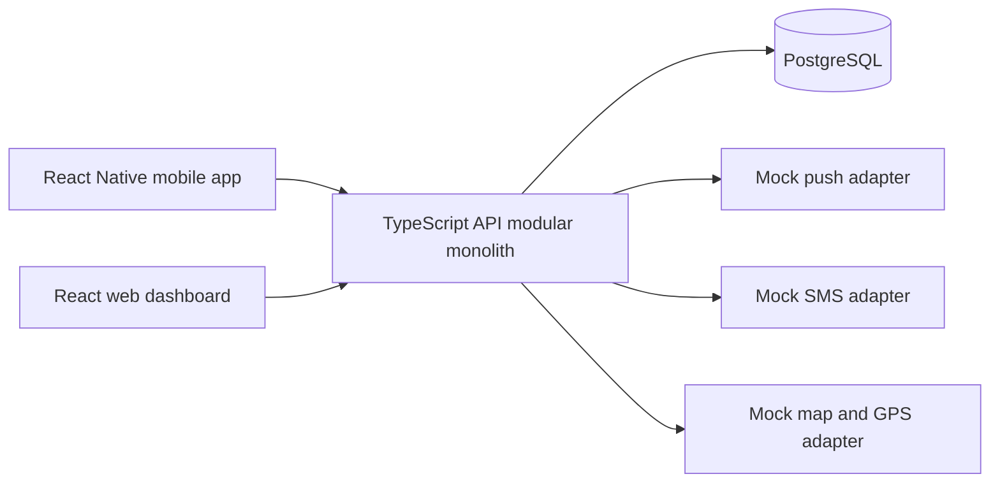
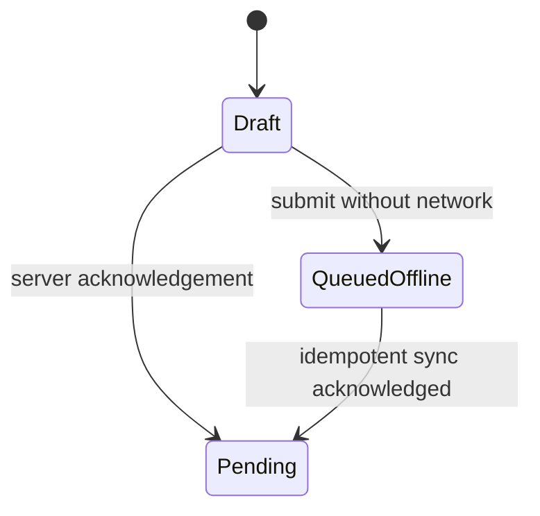
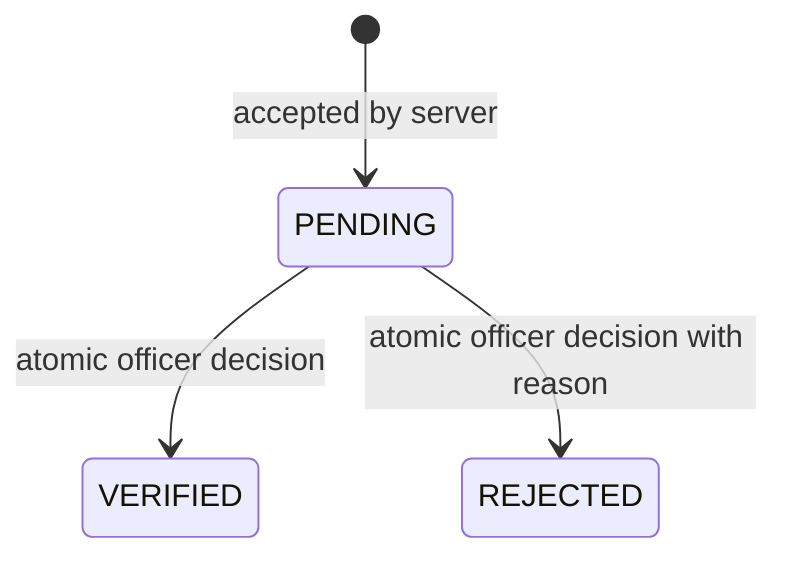
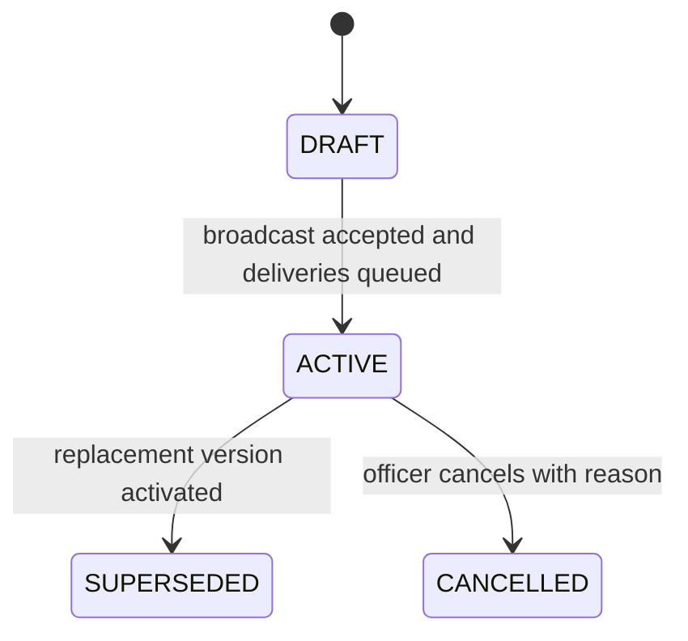
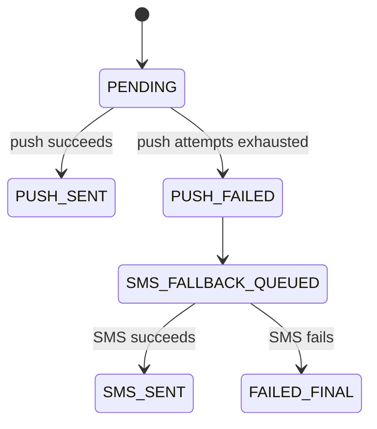
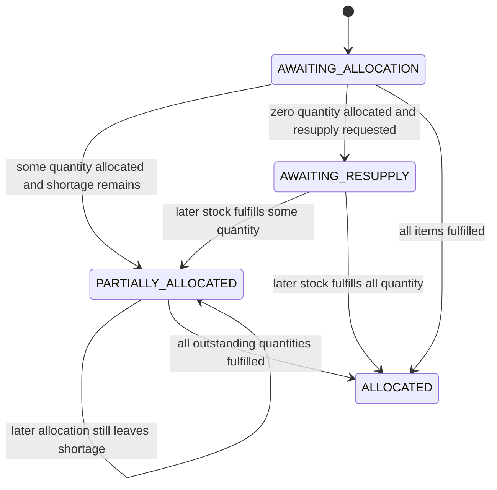

# Frozen Architecture and Domain Model

## System boundary



The mobile app owns the citizen and volunteer reporting experience, including local offline storage. The web app owns DMC verification, alert broadcasting and district relief allocation. The API exposes one consistent authorization, validation, transaction and audit model.

## Recommended repository structure

```text
apps/
  mobile/
  web/
  api/
packages/
  domain/
  shared-types/
  shared-validation/
  api-client/
  config/
docs/
  design-freeze/
  revised-uml/
  testing/
  report/
  ai-prompts/
```

## Module boundaries

| Module | Owner | Writes | Reads |
| --- | --- | --- | --- |
| Hazard submission | Eshan | HazardReport creation; mobile offline queue | Reporter, Location |
| Hazard verification | Javahir | VerificationDecision; final report status; draft escalation request | Pending HazardReport |
| Hazard broadcast | Sandaruwan | Alert, target links, deliveries, broadcast audit | Verified HazardReport |
| Relief allocation | Shiham | ResourceAllocation, AllocationItem, stock decrement, distribution log, resupply request, dispatch | ReliefRequest, Shelter, TargetZone, WarehouseStock, Organisation, RescueTeam |

No feature may directly write another owner's aggregate except through a frozen application operation. Shared types require Shiham's integration review and the affected feature owner's approval.

## Shared value types and enums

```text
UserRole = CITIZEN | VOLUNTEER | DMC_DUTY_OFFICER | DISTRICT_OFFICER
HazardType = FLOOD | LANDSLIDE | CYCLONE | DROUGHT
LocationSource = GPS | MANUAL
ReportStatus = PENDING | VERIFIED | REJECTED
AlertStatus = DRAFT | ACTIVE | SUPERSEDED | CANCELLED
AlertSeverity = ADVISORY | WARNING | EVACUATION
DeliveryStatus = PENDING | PUSH_SENT | PUSH_FAILED | SMS_FALLBACK_QUEUED | SMS_SENT | FAILED_FINAL
ReliefRequestStatus = AWAITING_ALLOCATION | PARTIALLY_ALLOCATED | AWAITING_RESUPPLY | ALLOCATED
ZoneSeverity = LOW | MODERATE | HIGH | CRITICAL
SupplyType = DRY_RATIONS | WATER | TENT | MEDICAL_KIT
RescueTeamStatus = AVAILABLE | EN_ROUTE | UNAVAILABLE
PartnerOrganisationType = NGO | ARMED_FORCES | PRIVATE_DONOR
PartnerResupplyStatus = REQUESTED | ACKNOWLEDGED | FULFILLED | CANCELLED
```

Alert severity names are the business labels shown in the original broadcast scenario. UI colors map `ADVISORY -> YELLOW`, `WARNING -> ORANGE`, and `EVACUATION -> RED`. `ZoneSeverity` is a separate relief-priority concept and must not be reused as `AlertSeverity`.

## Core entities

### Identity and location

- `User(id, name, contactNo, role)`
- `Volunteer(userId, assignedAreaId)`
- `DmcOfficer(userId, dutyStation, canBroadcast)`
- `DistrictOfficer(userId, districtId)`
- `Location(id, latitude, longitude, districtId, address, source)`
- `TargetZone(id, name, districtId, severity, geometryRef)`

### Hazard submission

- `HazardReport(id, clientReportId, reporterId, hazardType, description, photoRef, locationId, submittedAt, status, outsideAssignedArea, requiresExtraReview)`
- Mobile-only `OfflineReport(clientReportId, payload, localStatus, lastAttemptAt, lastError)`

`clientReportId` is unique. `QUEUED_OFFLINE` is a mobile-local status and is not stored in the central `ReportStatus` column.

### Verification

- `VerificationDecision(id, reportId, officerId, result, reason, decidedAt)`

`reportId` is unique in `VerificationDecision`. `reason` is mandatory for `REJECTED` and optional for `VERIFIED`.

### Broadcast

- `Alert(id, sourceReportId, createdByOfficerId, hazardType, severity, message, safetyInstructions, status, version, parentAlertId, issuedAt, cancelledAt, cancellationReason)`
- `AlertTargetZone(alertId, targetZoneId)`
- `NotificationDelivery(id, alertId, recipientRef, status, attemptNo, lastFailureReason, updatedAt)`
- `BroadcastAudit(id, alertId, officerId, action, reason, createdAt)`

Only one initial alert draft may exist for a source report. Replacement alert versions use `parentAlertId` and increment `version`.

### Relief allocation

- `Shelter(id, name, districtId, locationId, capacity, currentOccupancy)`
- `ReliefRequest(id, shelterId, targetZoneId, status, priorityNote, createdAt, version)`
- `ReliefRequestItem(id, requestId, supplyType, requestedQty)`
- `WarehouseStock(id, districtId, supplyType, availableQty, version, syncedAt)`
- `ResourceAllocation(id, requestId, officerId, idempotencyKey, notes, createdAt)`
- `AllocationItem(id, allocationId, requestItemId, supplyType, allocatedQty)`
- `DistributionLog(id, allocationId, allocationItemId, districtId, supplyType, quantity, createdAt)`
- `PartnerOrganisation(id, districtId, name, type, active)`
- `PartnerResupplyRequest(id, reliefRequestId, partnerOrganisationId, supplyType, requestedQty, status, createdAt)`
- `RescueTeam(id, districtId, name, status, locationId, version)`
- `TransportDispatch(id, allocationId, rescueTeamId, destinationLocationId, dispatchedAt)`

## State machines

### Mobile report synchronization



### Central hazard report



No final report may return to `PENDING`, and no second final decision is allowed.

### Alert



Discarding a draft is a deletion operation, not a lifecycle transition.

### Delivery



### Relief request



### Rescue team

```text
AVAILABLE -> EN_ROUTE
```

The return-to-available workflow is outside the selected use case.

## Cross-component invariants

1. Server-side `HazardReport` creation is idempotent by `clientReportId`.
2. Only `PENDING` reports can receive a `VerificationDecision`.
3. Only `VERIFIED` reports can create an initial alert draft.
4. One report cannot create duplicate initial alert drafts.
5. Only `DRAFT` alerts can be broadcast.
6. Only `ACTIVE` alerts can be updated, superseded or cancelled.
7. Public map data comes only from `ACTIVE` alerts.
8. Notification failures never change the report state and do not revert an `ACTIVE` alert.
9. Warehouse stock never becomes negative.
10. Total allocated quantity for a request item never exceeds its requested quantity.
11. Relief allocation never changes shelter capacity or current occupancy.
12. Only one officer operation can win a conflicting version/state update.
13. An `EN_ROUTE` or `UNAVAILABLE` rescue team cannot be dispatched.
14. Audit/log records are created in the same transaction as the business state change they describe.

